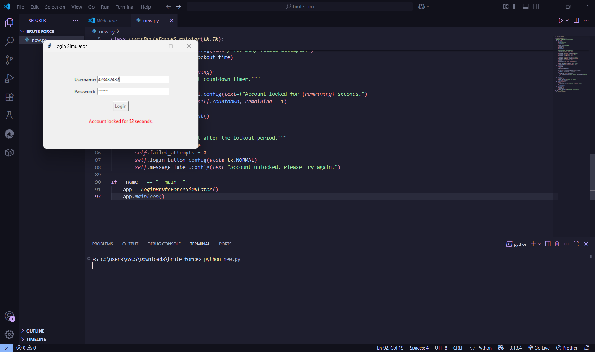

SECTION 1 TASK 3 
# 🔐 Login Brute Force Simulator (Python)

A simple console-based simulator to demonstrate brute-force login protection.

## 🚀 Features

- Hardcoded username and password
- Allows up to 3 incorrect login attempts
- Locks out after failed attempts
- Pure Python script, no external libraries

